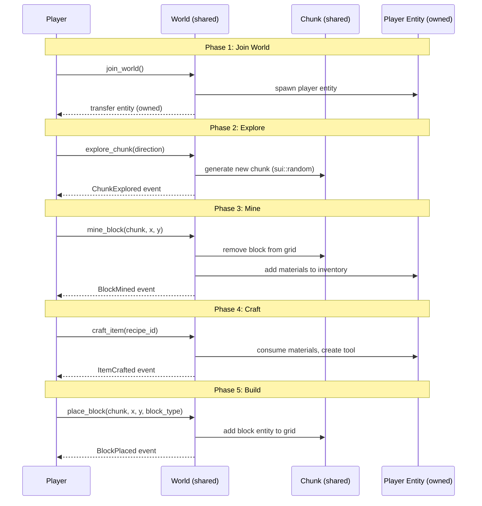

# SuiCraft — Fully On-Chain Sandbox Game on Sui

> A Minecraft-inspired, turn-based voxel sandbox built entirely on the Sui blockchain using the ECS game engine.

---

## 1. Vision & Core Fantasy

**One-liner:** *Build, explore, and survive in a persistent voxel world where every block, item, and action is a verifiable on-chain transaction.*

SuiCraft reimagines Minecraft as a **turn-based**, **fully on-chain** sandbox. Instead of real-time mining and building, players take discrete actions each turn: place a block, mine a tile, craft an item, or explore a new chunk. The world is **persistent and shared** — what you build stays forever, and other players can see, interact with, and build alongside your creations.

### Why On-Chain?

| Benefit | How SuiCraft Uses It |
|---------|---------------------|
| **True ownership** | Every block you place, item you craft, and structure you build is a Sui object you own |
| **Persistence** | The world persists forever on-chain — no server shutdowns |
| **Composability** | Other games/apps can read your world, use your items, extend your builds |
| **Provably fair** | Resource generation, loot drops, and world gen use `sui::random` — no server-side cheating |
| **Permissionless** | Anyone can build tools, mods, or clients that interact with the world contracts |

---

## 2. Game Concept Validation

> Using the [on-chain game builder validation checklist](file:///Users/postgres/Documents/work/makara/makura/sui-on-chain-games-examples/.agent/skills/sui-on-chain-game-builder-skills/SKILL.md):

| Question | Answer | Verdict |
|----------|--------|---------|
| Can every player action be a separate transaction? | ✅ Place block, mine block, craft item, move — all discrete | ✅ Good fit |
| Does the game need continuous input? | ❌ No hold/drag/real-time needed | ✅ Good fit |
| Does game state change in discrete steps? | ✅ Each action changes world state atomically | ✅ Good fit |
| Does timing between actions matter (ms)? | ❌ Turn-based, no time pressure | ✅ Good fit |
| Would it work as a board game? | ✅ Grid-based placement, finite actions per turn | ✅ Good fit |

> [!NOTE]
> Real-time Minecraft wouldn't work on-chain, but a **turn-based sandbox** preserves the core fantasy: creative building, resource gathering, crafting, and exploration in a shared persistent world.

---

## 3. MDA Framework Analysis

> From the [game-design-theory skill](file:///Users/postgres/Documents/work/makara/makura/sui-on-chain-games-examples/.agents/skills/game-design-theory/SKILL.md):

### Mechanics (Rules)
- **Grid-based world** divided into 16×16 chunks
- **Turn actions**: Mine, Place, Craft, Move, Explore (new chunk)
- **Resource system**: Blocks drop materials when mined
- **Crafting recipes**: Combine materials into tools, blocks, items
- **Tool durability**: Tools degrade with use
- **Energy per turn**: Limited actions via Energy component (regen each turn)
- **Biome generation**: On-chain random determines terrain type per chunk

### Dynamics (Emergent Behavior)
- Players collaboratively build structures across the shared world
- Resource scarcity drives trading between players
- Territory emerges as players claim chunks through building
- Tool economy: crafted tools become tradeable NFT objects
- Community projects: multiple players contribute to massive builds

### Aesthetics (Player Experience)
| Bartle Type | SuiCraft Appeal |
|-------------|-----------------|
| **Achiever** | Crafting progression, rare materials, building milestones |
| **Explorer** | Discovering new chunks, biomes, underground caves |
| **Socializer** | Collaborative building, trading, shared world |
| **Killer** | Territory control, resource competition |

---

## 4. Core Game Loop

```
┌──────────────────────────────────────────────────────────────────┐
│                     SUICRAFT CORE LOOP                           │
├──────────────────────────────────────────────────────────────────┤
│  1. EXPLORE    → Move to new position / discover chunk           │
│  2. GATHER     → Mine blocks → receive materials                 │
│  3. CRAFT      → Combine materials → create tools/blocks         │
│  4. BUILD      → Place blocks → shape the world                  │
│  5. PROGRESS   → Better tools → deeper exploration → rarer loot  │
│  6. REPEAT     → Each turn = 1 action cycle                      │
│                                                                  │
│  Engagement Drivers:                                             │
│  ✓ Creative expression (building)                                │
│  ✓ Discovery (chunk exploration)                                 │
│  ✓ Progression (tool tiers)                                      │
│  ✓ Economy (trade items as NFTs)                                 │
│  ✓ Community (shared persistent world)                           │
└──────────────────────────────────────────────────────────────────┘
```

---

## 5. On-Chain Architecture

### 5.1 ECS Mapping

> Using the [ECS game engine principles](file:///Users/postgres/Documents/work/makara/makura/sui-on-chain-games-examples/.agent/skills/sui-move-skills/game_engine/SKILL.md):

```
┌─────────────────────────────────────────────────────────────┐
│  GAME LAYER (SuiCraft)                                       │
│  Chunk management, crafting, building, biome generation       │
└──────────────────────┬──────────────────────────────────────┘
                       │ uses
┌──────────────────────▼──────────────────────────────────────┐
│  ENGINE LAYER (ECS Engine)                                   │
│  Entity, Component attachment, Dynamic fields, World API     │
└─────────────────────────────────────────────────────────────┘
```

### 5.2 Entity Types

| Entity | Components | Description |
|--------|-----------|-------------|
| **Player** | Position, Health, Energy, Inventory, Identity, Stats | The player character |
| **Block** | Position, Marker, Team | A placed block in the world (marker_type = block type) |
| **Chunk** | Zone, custom `ChunkData` | A 16×16 world segment with terrain data |
| **Item** | Identity, custom `ItemData` | Crafted tool or material in inventory |
| **Structure** | Zone, Identity, custom `StructureData` | A named multi-block build (house, bridge, etc.) |

### 5.3 Component Selection

> Using the [component picker](file:///Users/postgres/Documents/work/makara/makura/sui-on-chain-games-examples/.agent/skills/sui-on-chain-game-builder-skills/references/component_picker.md):

```
Built-in Components:
  Position     — player/block world coordinates
  Health       — player HP (survival element)
  Energy       — actions per turn (current/max/regen)
  Inventory    — player's held items (vector<u64>)
  Identity     — player name, level
  Stats        — strength (mining power), dexterity (move range), intelligence (craft bonus)
  Marker       — block type identifier (stone=0, wood=1, dirt=2, iron=3, diamond=4)
  Team         — player ID / faction for ownership
  Zone         — chunk ownership, capture progress
  Gold         — in-game currency for trading

Custom Components (Tier 1 — Dynamic Fields):
  b"block_type"       — u8: type of block (on Block entities)
  b"durability"       — u64: remaining uses (on tool Items)
  b"biome"            — u8: chunk biome type
  b"terrain_data"     — vector<u8>: 256 bytes encoding 16×16 tile types
  b"is_underground"   — bool: whether chunk is a cave layer
  b"craft_level"      — u64: player's crafting skill level

Custom Components (Tier 2 — Full Modules):
  CraftingRecipe      — ingredients: vector<MaterialReq>, result_id: u64, required_level: u64
  ChunkData           — biome: u8, terrain: vector<u8>, explored_by: vector<address>
  ToolData            — tool_type: u8, tier: u8, durability: u64, mining_power: u64
```

### 5.4 Systems Used

| System | Purpose in SuiCraft |
|--------|---------------------|
| `grid_sys` | Manage 16×16 chunk grids, check occupancy |
| `spawn_sys` | Create player entities, block entities, item entities |
| `movement_sys` | Player movement within chunks |
| `turn_sys` | Turn management (simultaneous or round-robin) |
| `energy_sys` | Action points per turn (3 energy, regen 3/turn) |
| `territory_sys` | Chunk claiming via building |
| `reward_sys` | Material drops from mining |
| Custom: `craft_sys` | Recipe-based crafting |
| Custom: `chunk_sys` | Procedural chunk generation |
| Custom: `build_sys` | Block placement/removal |

---

## 6. World Structure

### 6.1 Chunk-Based World

```
World Map (infinite, loaded on demand):
┌──────┬──────┬──────┬──────┐
│(0,0) │(1,0) │(2,0) │ ...  │   Each cell = 1 Chunk (16×16 grid)
├──────┼──────┼──────┼──────┤   Each Chunk = separate Sui shared object
│(0,1) │(1,1) │(2,1) │ ...  │   Loaded when a player explores it
├──────┼──────┼──────┼──────┤
│(0,2) │(1,2) │(2,2) │ ...  │
└──────┴──────┴──────┴──────┘

Inside a Chunk (16×16):
┌─┬─┬─┬─┬─┬─┬─┬─┬─┬─┬─┬─┬─┬─┬─┬─┐
│🌲│🌲│ │🪨│ │ │🌲│ │ │ │🪨│🪨│ │ │🌲│ │
├─┼─┼─┼─┼─┼─┼─┼─┼─┼─┼─┼─┼─┼─┼─┼─┤
│ │ │🏠│🏠│🏠│ │ │ │💎│ │ │ │ │🌲│ │ │
│...                                │
└─┴─┴─┴─┴─┴─┴─┴─┴─┴─┴─┴─┴─┴─┴─┴─┘

Block Types:   🌲=Wood  🪨=Stone  💎=Diamond  🏠=Player-placed
```

### 6.2 On-Chain Storage Design

> Using [Sui Move patterns](file:///Users/postgres/Documents/work/makara/makura/sui-on-chain-games-examples/.agent/skills/sui-move-skills/sui_move_patterns/SKILL.md) and [Sui framework modules](file:///Users/postgres/Documents/work/makara/makura/sui-on-chain-games-examples/.agent/skills/sui-move-skills/sui_framework/SKILL.md):

| Data | Storage Method | Rationale |
|------|---------------|-----------|
| Chunk terrain (256 tiles) | `vector<u8>` in dynamic field | Compact, fits in object size limit (256 bytes) |
| Placed blocks | Entity per block with Position | True ownership, transferable, tradeable |
| Player inventory | `Inventory` component (`vector<u64>`) | Engine-native, bounded |
| Crafting recipes | Shared `Registry` config object | Admin-tunable, no upgrade needed |
| World seed | Immutable object | Deterministic generation, tamper-proof |
| Chunk metadata | `Table<ChunkCoord, ID>` on World | O(1) chunk lookup by coordinate |

> [!IMPORTANT]
> **Object Size Limit: 256 KB.** Each chunk stores terrain as a `vector<u8>` (256 bytes for 16×16). Placed blocks are separate Entity objects, not stored inside the chunk. This keeps chunks well under the limit.

> [!IMPORTANT]
> **Dynamic Fields per TX: 1,000 max.** Bulk operations (e.g., "fill area with blocks") must be capped at ~100 blocks per transaction to stay safe.

---

## 7. Game Mechanics

### 7.1 Actions Per Turn

Each turn, a player has **3 Energy** (configurable via Registry). Each action costs energy:

| Action | Energy Cost | Description |
|--------|------------|-------------|
| **Mine** | 1 | Destroy a block → receive materials (amount based on tool tier) |
| **Place** | 1 | Place a block from inventory at an empty grid position |
| **Move** | 1 | Move to an adjacent tile (or further with Movement component) |
| **Craft** | 2 | Combine materials into a tool or new block type |
| **Explore** | 3 | Generate and reveal an adjacent unexplored chunk |
| **Trade** | 0 | List/buy items (separate marketplace transaction) |

### 7.2 Block Types & Resources

| Block | ID | Biome | Drops | Tool Required |
|-------|----|-------|-------|---------------|
| Dirt | 0 | All | 1× Dirt | None (hand) |
| Wood | 1 | Forest, Plains | 2× Wood Planks | None |
| Stone | 2 | Mountains, Caves | 1× Cobblestone | Wood Pickaxe+ |
| Iron Ore | 3 | Caves | 1× Iron Ingot | Stone Pickaxe+ |
| Gold Ore | 4 | Deep Caves | 1× Gold Ingot | Iron Pickaxe+ |
| Diamond Ore | 5 | Deep Caves (rare) | 1× Diamond | Iron Pickaxe+ |
| Sand | 6 | Desert, Beach | 1× Sand | None |
| Obsidian | 7 | Volcanic | 1× Obsidian | Diamond Pickaxe |

### 7.3 Crafting System

Recipes stored in a shared `CraftingRegistry` config object (following the [config over constants principle](file:///Users/postgres/Documents/work/makara/makura/sui-on-chain-games-examples/.agent/skills/sui-move-skills/game_engine/SKILL.md)):

| Recipe | Ingredients | Result | Mining Power |
|--------|------------|--------|-------------|
| Wood Pickaxe | 3× Wood Planks | Pickaxe (tier 1) | 1 |
| Stone Pickaxe | 3× Cobblestone + 2× Wood | Pickaxe (tier 2) | 2 |
| Iron Pickaxe | 3× Iron Ingot + 2× Wood | Pickaxe (tier 3) | 3 |
| Diamond Pickaxe | 3× Diamond + 2× Wood | Pickaxe (tier 4) | 5 |
| Wood Planks ×4 | 1× Wood | 4× Wood Planks | — |
| Furnace | 8× Cobblestone | Furnace block | — |
| Chest | 8× Wood Planks | Storage block (expands inventory) | — |
| Torch ×4 | 1× Wood + 1× Coal | 4× Light blocks | — |

### 7.4 Biome Generation

When a player explores a new chunk, `sui::random` determines the biome:

```
Biome Roll (u8 % 100):
  0–24   → Plains    (grass, flowers, few trees)
  25–44  → Forest    (dense trees, wood-rich)
  45–59  → Mountains (stone, iron ore, elevation)
  60–69  → Desert    (sand, sandstone, cacti)
  70–79  → Caves     (underground, ore-rich, dark)
  80–89  → Deep Caves (gold, diamond, obsidian, dangerous)
  90–94  → Beach     (sand, water edge, shells)
  95–99  → Volcanic  (lava borders, obsidian, rare materials)
```

Each tile within the chunk is then generated deterministically from the world seed + chunk coordinates.

### 7.5 Survival Elements

| Mechanic | Implementation |
|----------|---------------|
| **Health** | `Health` component (100 max). Hazardous biomes drain HP per turn spent. |
| **Hunger** | Tier 1 dynamic field `b"hunger"` (100 max, -5/turn, eat food to restore). Below 20 = halved Energy regen. |
| **Tool Durability** | `ToolData.durability` decreases per mine action. At 0, tool breaks (entity deleted). |
| **Day/Night Cycle** | GameSession `turn_counter % 20`: turns 0–14 = day, 15–19 = night (hostile mobs possible). |

---

## 8. Multiplayer Design

### 8.1 Session Model

> Using the [game lifecycle patterns](file:///Users/postgres/Documents/work/makara/makura/sui-on-chain-games-examples/.agent/skills/sui-on-chain-game-builder-skills/references/game_lifecycle.md):

```
Deploy → init() creates World + initial chunk grid
   ↓
Players join_world() — unlimited players (no lobby cap)
   ↓
Simultaneous turns — all players act independently each turn
   ↓
Persistent — world never ends (no FINISHED state)
```

> [!NOTE]
> Unlike PvP games, SuiCraft uses a **persistent world** model. The GameSession never transitions to FINISHED. Players join and leave freely. The World object is the permanent anchor.

### 8.2 Object Ownership

| Object | Ownership | Rationale |
|--------|-----------|-----------|
| World | Shared | All players interact with it |
| Chunk (Grid) | Shared | Multiple players can build in the same chunk |
| Player Entity | **Owned** | Only the player modifies their own character |
| Placed Blocks | **Owned** by placer | Builder owns their blocks (can trade/remove) |
| Crafted Items | **Owned** by crafter | True NFT ownership of tools and materials |
| CraftingRegistry | Shared (immutable) | Everyone reads recipes |

### 8.3 Conflict Resolution

Since multiple players can act in the same chunk:

- **Block placement**: First-come-first-served (grid occupancy check via `grid_sys::is_occupied`)
- **Mining other players' blocks**: Requires owner consent (or PvP mode toggle)
- **Chunk discovery**: Multiple players can explore the same chunk — generation is deterministic from seed, so result is identical regardless of who discovers it

---

## 9. Sui-Specific Architecture

### 9.1 Package Structure

```
packages/
├── entity/                    # ENGINE (git dependency)
├── components/                # ENGINE (git dependency)
├── systems/                   # ENGINE (git dependency)
├── world/                     # ENGINE (git dependency)
└── suicraft/                  # GAME
    ├── sources/
    │   ├── game.move          # Main game contract (init, join, actions)
    │   ├── chunk_gen.move     # Chunk generation system
    │   ├── crafting.move      # Crafting system + registry
    │   ├── building.move      # Block placement / removal
    │   ├── mining.move        # Mining + material drops
    │   ├── exploration.move   # Chunk discovery + biome gen
    │   ├── types.move         # Custom structs (ChunkData, ToolData, etc.)
    │   ├── events.move        # Event definitions
    │   └── game_tests.move    # All tests (#[test_only])
    └── Move.toml
```

### 9.2 Key Sui Features Used

| Feature | Usage |
|---------|-------|
| **Dynamic fields** | Block data on chunks, inventory items on players, terrain on chunks |
| **`sui::random`** | Biome generation, loot drops, cave formations |
| **`sui::clock`** | Timestamp for entity creation, time-gated events |
| **`sui::event`** | `BlockPlaced`, `BlockMined`, `ItemCrafted`, `ChunkExplored` events for frontend |
| **Shared objects** | World, Chunks, CraftingRegistry |
| **Owned objects** | Player entities, blocks, crafted items |
| **`Table<K,V>`** | Chunk coordinate → Chunk ID lookup on the World |
| **Transfer policies** | Marketplace for trading blocks and tools |
| **Sponsored transactions** | Gasless UX — new players can start without SUI tokens |

### 9.3 Gas Optimization

> Following [Sui engineering practices](file:///Users/postgres/Documents/work/makara/makura/sui-on-chain-games-examples/.agent/skills/sui-move-skills/sui_engineering/SKILL.md):

| Strategy | Application |
|----------|-------------|
| Batch actions in PTBs | Mine + Craft + Place in one transaction |
| Minimize dynamic field reads | Cache biome type on chunk entity itself |
| Use `vector<u8>` for terrain | 256 bytes vs 256 dynamic fields = massive gas savings |
| Owned player entities | Fast-path (no consensus) for inventory management |
| Limit bulk operations | Max 50 blocks placed per TX to stay under limits |

---

## 10. Frontend Architecture

> Using the [frontend builder skill](file:///Users/postgres/Documents/work/makara/makura/sui-on-chain-games-examples/.agent/skills/sui-on-chain-game-frontend-builder/SKILL.md):

### 10.1 Tech Stack

```
Vite + React + TypeScript
@mysten/dapp-kit-react     → wallet connection, transaction signing
@mysten/sui                → SuiJsonRpcClient for data reads
@tanstack/react-query      → polling chunk/player state
zustand                    → client-side UI state
Phaser 3                   → 2D isometric/top-down rendering
```

### 10.2 Rendering Approach

> Using the [Phaser gamedev skill](file:///Users/postgres/Documents/work/makara/makura/sui-on-chain-games-examples/.agents/skills/phaser-gamedev/SKILL.md):

The frontend uses **Phaser 3** embedded in the React app for the game canvas:

| Scene | Purpose |
|-------|---------|
| `BootScene` | Load tileset assets, block sprites, character sprites |
| `WorldScene` | Main gameplay — renders chunks, blocks, players |
| `InventoryScene` | UI overlay — shows inventory, crafting, tools |
| `CraftingScene` | Recipe browser + crafting interface |

**Tilemap approach:**
- Each chunk is a Phaser `Tilemap` created from on-chain terrain data
- Player-placed blocks are Phaser sprites overlaid on the tilemap
- Camera follows the player's Position component
- Chunk loading/unloading as the camera moves (lazy loading from chain)

### 10.3 Data Flow

```
On-Chain (Sui)                    Frontend (React + Phaser)
─────────────                     ─────────────────────────
World object          ──poll──→   useQuery(worldId, { refetchInterval: 2000 })
Chunk terrain data    ──poll──→   Phaser Tilemap layer
Player Position       ──poll──→   Phaser sprite position
Player Inventory      ──poll──→   React Inventory panel
Crafting Registry     ──once──→   React Recipe browser

Player action (mine)  ←──tx───   signAndExecuteTransaction(mineTx)
   → waitForTransaction
   → refetchQueries (refresh state)
```

---

## 11. Progression & Balance

### 11.1 Progression Tiers

```
Tier 0 — Bare Hands:    Mine dirt/wood only, slow
Tier 1 — Wood Tools:    Mine stone, moderate speed
Tier 2 — Stone Tools:   Mine iron ore, good speed
Tier 3 — Iron Tools:    Mine gold/diamond, fast
Tier 4 — Diamond Tools: Mine everything, maximum speed, high durability
```

### 11.2 Difficulty Curve (Flow Channel)

```
     Complexity
          ↑
   Hard   │           ████  ← Deep caves, rare ores, complex recipes
          │         ██████
          │       ████████      ← FLOW CHANNEL
          │     ████████████
   Easy   │   ██████████████  ← Dirt, wood, basic crafting
          └──────────────────────→
            Early Game    Late Game
```

### 11.3 Economy Sinks & Faucets

| Faucet (Inflow) | Sink (Outflow) |
|-----------------|----------------|
| Mining blocks → materials | Crafting consumes materials |
| Exploring chunks → new resources | Tool durability → tools break |
| Trading with players | Hunger system consumes food |
| Rare drops from deep caves | Building consumes blocks |

---

## 12. Event-Driven Off-Chain Communication

All significant state changes emit events for the frontend:

```move
// Event definitions (events.move)
public struct BlockPlaced has copy, drop {
    player: address,
    chunk: ID,
    x: u64, y: u64,
    block_type: u8,
}

public struct BlockMined has copy, drop {
    player: address,
    chunk: ID,
    x: u64, y: u64,
    block_type: u8,
    materials_dropped: vector<u64>,
}

public struct ChunkExplored has copy, drop {
    player: address,
    chunk_x: u64,
    chunk_y: u64,
    biome: u8,
    chunk_id: ID,
}

public struct ItemCrafted has copy, drop {
    player: address,
    recipe_id: u64,
    result_item_id: ID,
}
```

---

## 13. Transaction Sequence



---

## 14. Verification Plan

### Automated Tests
```bash
# Build the contract
sui move build

# Run all tests
sui move test

# Tests to write (in game_tests.move):
# - test_join_world: player joins, entity spawned with correct components
# - test_explore_chunk: new chunk generated with valid biome
# - test_mine_block: block removed, materials added to inventory
# - test_craft_item: materials consumed, tool created with correct stats
# - test_place_block: block placed at empty position
# - test_place_block_occupied: fails when position occupied
# - test_mine_without_tool: fails for stone+ without pickaxe
# - test_energy_limit: fails when energy insufficient
# - test_tool_durability: tool destroyed after max uses
```

### Manual Verification
- Deploy to **devnet** and verify via Sui Explorer
- Frontend renders chunk terrain from on-chain data
- Wallet connects and signs transactions
- Multiple players can build in the same chunk simultaneously
- Placed blocks persist across browser refreshes

---

## 15. Future Extensions

| Feature | Description | Complexity |
|---------|-------------|------------|
| **Mobs** | Hostile entities that spawn at night, use combat_sys | Medium |
| **Redstone-like Logic** | Signal blocks that trigger actions | High |
| **Water/Lava Physics** | Flow simulation (turn-based cellular automata) | High |
| **Structures** | Named multi-block templates (save/load builds) | Medium |
| **Land Deeds** | NFT-based chunk ownership with rent/tax | Medium |
| **Cross-Game Items** | Use SuiCraft tools in other Sui games | Low |
| **DAO Governance** | Community votes on world rules, biome rates | Medium |
| **Seasonal Events** | Limited-time biomes, rare materials | Low |

---

## 16. Summary

SuiCraft adapts Minecraft's core fantasy — **creative building in a shared, persistent world** — to the constraints and superpowers of Sui's blockchain. By making it turn-based and using the ECS game engine, every action is a verifiable transaction, every item is a true NFT, and the world lives forever on-chain.

The game leverages all layers of the skill stack:
- **ECS Engine** → Entity/Component/System architecture for game state
- **Sui Move Patterns** → Dynamic fields, object model, owned vs shared
- **Sui Framework** → Randomness, clock, events, tables
- **Sui Engineering** → Gas optimization, upgradeability, error handling
- **Game Design Theory** → MDA framework, flow channel, Bartle types, reward systems
- **Phaser Gamedev** → 2D rendering, tilemap-based world display
- **Frontend Builder** → Vite + React + dApp Kit for wallet + transaction UX
