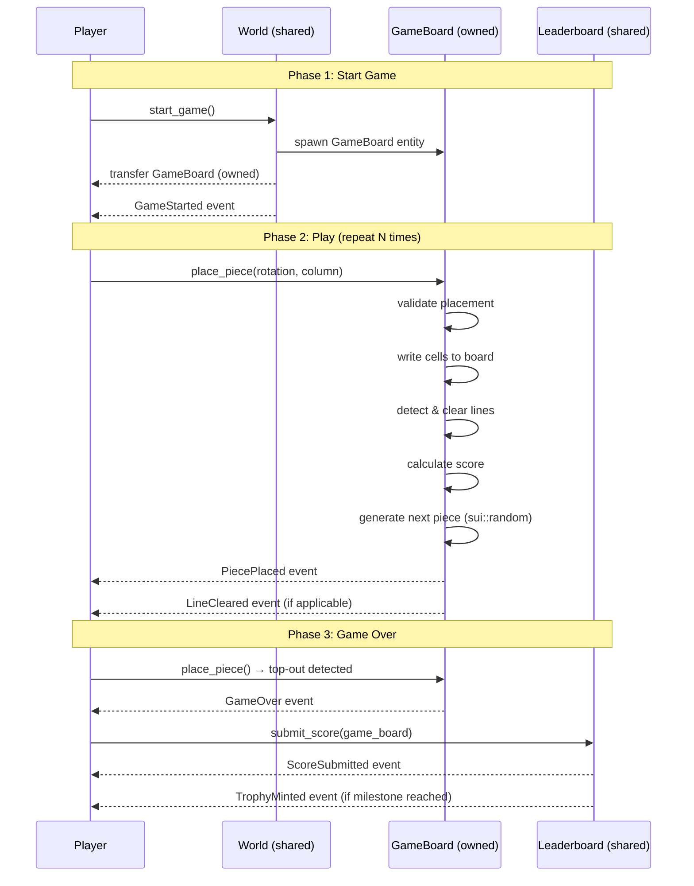
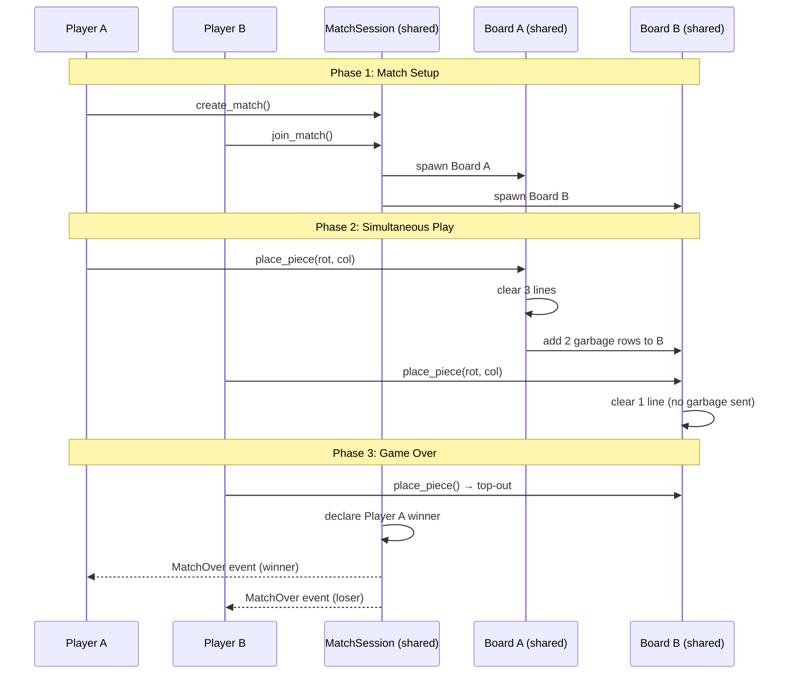

# SuiTris — Fully On-Chain Tetris on Sui

> A turn-based Tetris adaptation built entirely on the Sui blockchain using the ECS game engine — where every piece placement is a verifiable transaction and high scores live forever on-chain.

---

## 1. Vision & Core Fantasy

**One-liner:** *Stack tetrominoes, clear lines, and climb the leaderboard in a fully on-chain puzzle game where every move is provably fair and every high score is immutable.*

SuiTris reimagines Tetris as a **turn-based, fully on-chain** puzzle game. Instead of real-time falling pieces, players take discrete turns: rotate, shift, and drop one piece per turn. The core tension — spatial optimization under constraint — is preserved while making every decision a verifiable blockchain transaction.

### Why On-Chain?

| Benefit | How SuiTris Uses It |
|---------|---------------------|
| **Provably fair** | Piece sequence generated by `sui::random` — no rigged drops, no server manipulation |
| **Immutable leaderboard** | High scores are on-chain objects — no fake entries, no database wipes |
| **True ownership** | Game sessions are Sui objects; completed boards can be minted as NFT trophies |
| **Composability** | Other games/apps can read your Tetris stats, use your rank, build tournaments |
| **Permissionless** | Anyone can build alternative frontends, bots, or tournament organizers |
| **Anti-cheat** | All moves are validated on-chain — impossible to hack scores or skip constraints |

---

## 2. Game Concept Validation

> Using the [on-chain game builder validation checklist](file:///Users/postgres/Documents/work/makara/makura/sui-on-chain-games-examples/.agent/skills/sui-on-chain-game-builder-skills/SKILL.md):

| Question | Answer | Verdict |
|----------|--------|---------|
| Can every player action be a separate transaction? | ✅ Rotate, shift, hard drop — all discrete | ✅ Good fit |
| Does the game need continuous input? | ❌ Turn-based: choose placement, confirm drop | ✅ Good fit |
| Does game state change in discrete steps? | ✅ Board state changes atomically per piece | ✅ Good fit |
| Does timing between actions matter (ms)? | ❌ No time pressure per turn (optional timer) | ✅ Good fit |
| Would it work as a board game? | ✅ Pentomino/puzzle board games exist | ✅ Good fit |

### Adaptation from Real-Time → Turn-Based

> Using the [Adaptation Guide](file:///Users/postgres/Documents/work/makara/makura/sui-on-chain-games-examples/.agent/skills/sui-on-chain-game-builder-skills/SKILL.md):

| Real-Time Tetris | Turn-Based On-Chain Version |
|------------------|-----------------------------|
| Pieces fall continuously with gravity | Each turn: player receives one piece, chooses column + rotation, piece is placed instantly |
| Speed increases every level | Difficulty scales via piece distribution (more S/Z/T pieces at higher levels) |
| Player presses keys to rotate/move in real-time | Player submits one transaction: `place_piece(rotation, column)` |
| Line clears happen during fall | Line clears are computed atomically after each placement |
| Game over when pieces reach the top | Game over when the placed piece overlaps the top boundary (row 0–1) |
| Score from combos and speed | Score from lines cleared, piece count, combos (consecutive multi-line clears) |

> [!NOTE]
> The **core tension** of Tetris — spatial optimization under constraint with an evolving board state — is fully preserved. What's removed is only the reflex/dexterity element (which is incompatible with blockchain transaction latency). The result plays like a **puzzle game** where every decision matters.

---

## 3. MDA Framework Analysis

> From the [game-design-theory skill](file:///Users/postgres/Documents/work/makara/makura/sui-on-chain-games-examples/.agents/skills/game-design-theory/SKILL.md):

### Mechanics (Rules)
- **10×20 board** (standard Tetris dimensions) stored as a compact grid
- **7 Tetromino types**: I, O, T, S, Z, L, J — each with 4 rotation states
- **Turn actions**: Rotate (0–3), select column, Hard Drop (mandatory)
- **Line clear**: Full rows are removed, rows above shift down
- **Scoring**: Points per lines cleared (single=100, double=300, triple=500, tetris=800)
- **Combo system**: Consecutive turns with line clears multiply score
- **Piece preview**: Next piece visible so player can plan
- **Gravity fills**: After line clears, all floating rows settle down

### Dynamics (Emergent Behavior)
- Players develop placement strategies to set up Tetris clears (4-line clears)
- Risk/reward: building tall for Tetrises vs. playing safe with singles
- Combo chasing: deliberate setups for consecutive multi-line clears
- Competitive pressure from the on-chain leaderboard
- Speed-running puzzle: minimum pieces to reach score thresholds

### Aesthetics (Player Experience)

| Bartle Type | SuiTris Appeal |
|-------------|----------------|
| **Achiever** | High score chasing, level milestones, trophy NFTs |
| **Explorer** | Discovering optimal placement strategies, unusual setups |
| **Socializer** | Leaderboard competition, sharing replay boards |
| **Killer** | Direct PvP mode: faster clears send garbage lines to opponent |

---

## 4. Core Game Loop

```
┌──────────────────────────────────────────────────────────────────┐
│                      SUITRIS CORE LOOP                           │
├──────────────────────────────────────────────────────────────────┤
│  1. RECEIVE   → Random tetromino generated (sui::random)         │
│  2. DECIDE    → Choose rotation (0–3) and column (0–9)           │
│  3. PLACE     → Piece hard-drops to lowest valid row             │
│  4. CLEAR     → Full rows detected and removed                   │
│  5. SCORE     → Points awarded based on lines cleared + combo    │
│  6. CHECK     → Game over if placement overlaps ceiling          │
│  7. REPEAT    → Next piece from queue                            │
│                                                                  │
│  Engagement Drivers:                                             │
│  ✓ Spatial puzzle satisfaction (perfect fits)                    │
│  ✓ Score optimization (combo chasing)                            │
│  ✓ Progression (level-up = harder piece distribution)            │
│  ✓ Competition (immutable on-chain leaderboard)                  │
│  ✓ Ownership (trophy NFTs for milestone scores)                  │
└──────────────────────────────────────────────────────────────────┘
```

---

## 5. On-Chain Architecture

### 5.1 ECS Mapping

> Using the [ECS game engine principles](file:///Users/postgres/Documents/work/makara/makura/sui-on-chain-games-examples/.agent/skills/sui-move-skills/game_engine/SKILL.md):

```
┌─────────────────────────────────────────────────────────────┐
│  GAME LAYER (SuiTris)                                        │
│  Piece generation, placement validation, line clears,        │
│  scoring, leaderboard, PvP garbage lines                     │
└──────────────────────┬──────────────────────────────────────┘
                       │ uses
┌──────────────────────▼──────────────────────────────────────┐
│  ENGINE LAYER (ECS Engine)                                   │
│  Entity, Component attachment, Dynamic fields, World API     │
└─────────────────────────────────────────────────────────────┘
```

### 5.2 Entity Types

| Entity | Components | Description |
|--------|-----------|-------------|
| **Player** | Identity, Stats, Gold, custom `TetrisStats` | The player profile and persistent stats |
| **GameBoard** | custom `BoardState` | The 10×20 grid for an active game session |
| **ActivePiece** | Marker, custom `PieceData` | Current tetromino (type, rotation, column) |
| **LeaderboardEntry** | Identity, Stats | Immutable score record for the leaderboard |
| **TrophyNFT** | Identity, Marker | Minted at milestone scores (10K, 50K, 100K) |

### 5.3 Component Selection

> Using the [component picker](file:///Users/postgres/Documents/work/makara/makura/sui-on-chain-games-examples/.agent/skills/sui-on-chain-game-builder-skills/references/component_picker.md):

```
Built-in Components:
  Identity     — player name, level (current Tetris level)
  Stats        — strength (N/A), dexterity (N/A), intelligence (used as "skill rating")
  Gold         — in-game currency earned from games (for cosmetics, entry fees)
  Marker       — piece type identifier (I=0, O=1, T=2, S=3, Z=4, L=5, J=6)

Custom Components (Tier 1 — Dynamic Fields):
  b"board"            — vector<u8>: 200 bytes encoding 10×20 cell grid (0=empty, 1–7=piece color)
  b"score"            — u64: current game score
  b"lines_cleared"    — u64: total lines cleared this game
  b"level"            — u64: current difficulty level (level = lines_cleared / 10)
  b"combo"            — u64: consecutive turns with line clears
  b"pieces_placed"    — u64: total pieces placed this game
  b"next_piece"       — u8: the next tetromino type (0–6)
  b"game_over"        — bool: whether the game has ended
  b"held_piece"       — u8: held piece type (255 = none)
  b"has_held"         — bool: whether player has used hold this turn

Custom Components (Tier 2 — Full Modules):
  BoardState    — cells: vector<u8> (200), width: u8, height: u8
  PieceData     — piece_type: u8, rotation: u8, col: u8
  TetrisStats   — games_played: u64, best_score: u64, total_lines: u64, total_tetrises: u64
```

### 5.4 Systems Used

| System | Purpose in SuiTris |
|--------|---------------------|
| `spawn_sys` | Create player entities, game board entities |
| `turn_sys` | Turn management (single-player: every action is a turn) |
| Custom: `piece_sys` | Generate random tetrominoes, validate rotations |
| Custom: `board_sys` | Place pieces, detect line clears, check game over |
| Custom: `score_sys` | Calculate score based on clears, combos, level |
| Custom: `leaderboard_sys` | Submit and rank scores on the on-chain leaderboard |
| Custom: `pvp_sys` | (PvP mode) Send garbage lines to opponent on clears |

---

## 6. Board Structure

### 6.1 The Tetris Grid

```
Board (10 wide × 20 tall, stored as vector<u8> of length 200):

     Col:  0  1  2  3  4  5  6  7  8  9
          ┌──┬──┬──┬──┬──┬──┬──┬──┬──┬──┐
 Row  0   │  │  │  │  │  │  │  │  │  │  │  ← Ceiling (game over zone)
 Row  1   │  │  │  │  │  │  │  │  │  │  │
          ├──┼──┼──┼──┼──┼──┼──┼──┼──┼──┤
 Row  2   │  │  │  │  │  │  │  │  │  │  │
 ...      │  │  │  │  │  │  │  │  │  │  │
          ├──┼──┼──┼──┼──┼──┼──┼──┼──┼──┤
 Row 17   │▓▓│  │  │▓▓│▓▓│▓▓│  │  │  │▓▓│
 Row 18   │▓▓│▓▓│  │▓▓│▓▓│▓▓│▓▓│  │▓▓│▓▓│
 Row 19   │▓▓│▓▓│▓▓│▓▓│▓▓│▓▓│▓▓│▓▓│▓▓│▓▓│  ← Full row (will clear)
          └──┴──┴──┴──┴──┴──┴──┴──┴──┴──┘

Cell values: 0=empty, 1=I, 2=O, 3=T, 4=S, 5=Z, 6=L, 7=J
Index formula: cells[row * 10 + col]
```

### 6.2 Tetromino Definitions

```
I-piece (type=0):
  Rotation 0: ████     Rotation 1:  █
                                    █
                                    █
                                    █

O-piece (type=1):
  All rotations: ██
                 ██

T-piece (type=2):
  Rot 0: █▀█    Rot 1: █     Rot 2:  ▀     Rot 3:  █
          █             ██           █▀█          ██
                        █                          █

S-piece (type=3):
  Rot 0:  ██    Rot 1: █
         ██            ██
                        █

Z-piece (type=4):
  Rot 0: ██     Rot 1:  █
          ██           ██
                       █

L-piece (type=5):
  Rot 0: █      Rot 1:         Rot 2: ██    Rot 3: ███
         █             ███           █            █
         ██            █             █

J-piece (type=6):
  Rot 0:  █     Rot 1: █       Rot 2: ██    Rot 3:       
          █            ███            █          ███
         ██                           █            █
```

### 6.3 On-Chain Storage Design

> Using [Sui Move patterns](file:///Users/postgres/Documents/work/makara/makura/sui-on-chain-games-examples/.agent/skills/sui-move-skills/sui_move_patterns/SKILL.md) and [Sui framework modules](file:///Users/postgres/Documents/work/makara/makura/sui-on-chain-games-examples/.agent/skills/sui-move-skills/sui_framework/SKILL.md):

| Data | Storage Method | Rationale |
|------|---------------|-----------|
| Board grid (200 cells) | `vector<u8>` in dynamic field | Compact (200 bytes), fits in object size limit |
| Active piece | Dynamic fields on GameBoard entity | Ephemeral per turn, lightweight |
| Player stats | `TetrisStats` component on Player entity | Persistent across games |
| Leaderboard | `Table<u64, LeaderboardEntry>` on World | O(1) rank lookup, ordered by score |
| Piece RNG seed | `sui::random` per piece | Provably fair, no pre-computation |
| Tetromino shapes | Hardcoded lookup table (const) | 7 pieces × 4 rotations = 28 fixed shapes, never changes |
| Game config | Shared `TetrisRegistry` config object | Admin-tunable scoring, level thresholds |

> [!IMPORTANT]
> **Board is only 200 bytes.** A `vector<u8>` of length 200 stores the entire 10×20 grid. This is extremely gas-efficient — each piece placement reads/writes at most ~40 bytes (the affected rows).

> [!IMPORTANT]
> **Piece shapes are pure constants.** The 7 tetrominoes in 4 rotations = 28 shapes. These are hardcoded in the Move module as lookup functions (`get_piece_cells(piece_type, rotation) → vector<(u8, u8)>`), not stored on-chain. Zero gas for shape lookups.

---

## 7. Game Mechanics

### 7.1 Turn Structure

Each turn, the player takes one composite action via a single transaction:

```
place_piece(game_board, rotation: u8, column: u8, ctx)
  1. Validate: game is active, board entity belongs to player
  2. Get current piece type (from b"next_piece" or generate first)
  3. Validate: rotation ∈ [0,3], column allows piece within bounds
  4. Compute landing row (hard drop — piece falls to lowest valid position)
  5. Check collision: ensure no overlap with existing cells
  6. Write piece cells to board vector
  7. Detect & clear full rows → shift rows down
  8. Update score based on lines cleared + combo
  9. Check game over: if any written cell is in rows 0–1, game ends
  10. Generate next piece via sui::random
  11. Emit PiecePlaced event
```

### 7.2 Scoring System

| Clear Type | Lines | Base Points | With Combo (×N) |
|------------|-------|-------------|-----------------|
| Single | 1 | 100 | 100 × N |
| Double | 2 | 300 | 300 × N |
| Triple | 3 | 500 | 500 × N |
| Tetris | 4 | 800 | 800 × N |
| Perfect Clear | All | 1500 bonus | 1500 × N |

- **Combo**: Resets to 0 if a turn produces no line clear. Increments by 1 for each consecutive turn with clears.
- **Level bonus**: `base_points × (1 + level / 10)` — higher levels award more points.
- **Soft drop bonus** (not applicable in turn-based, but pieces placed lower = 1 point per row dropped)

### 7.3 Level Progression

```
Level = total_lines_cleared / 10

Level thresholds:
  Level 0:  0 lines   → standard 7-piece bag
  Level 1:  10 lines  → slightly fewer I-pieces in bag
  Level 5:  50 lines  → weighted toward S/Z pieces
  Level 10: 100 lines → maximum difficulty distribution
  Level 15: 150 lines → "expert" distribution + garbage rows
```

### 7.4 Piece Distribution (7-Bag System)

To ensure fairness, pieces are generated using the **7-Bag** randomization:

```
1. Create a "bag" of all 7 piece types: [I, O, T, S, Z, L, J]
2. Shuffle bag using sui::random
3. Deal pieces from the bag one at a time
4. When bag is empty, create a new shuffled bag

This guarantees:
  - No piece drought longer than 12 turns (worst case: piece at end of bag 1, same piece at start of bag 2)
  - No piece flooding (can't get 5 I-pieces in a row)
  - Provably fair — shuffle is on-chain randomness
```

### 7.5 Hold Piece Mechanic

```
hold_piece(game_board, ctx)
  1. Can only hold once per turn (b"has_held" = false)
  2. Swap current piece with held piece (or store current, draw next)
  3. Set b"has_held" = true (resets on next place_piece)
  4. No placement — the held piece is stored for future turns
```

### 7.6 Game Over Conditions

| Condition | Detection | Result |
|-----------|-----------|--------|
| **Top-out** | Placed piece occupies cells in rows 0 or 1 | Game over |
| **Block-out** | New piece spawns but collides with existing cells | Game over |
| **Surrender** | Player calls `surrender()` | Game over |

On game over:
1. Final score is recorded
2. `TetrisStats` on player entity is updated (games_played, best_score)
3. Score is submitted to the leaderboard (`Table` on World)
4. If score exceeds a milestone, a TrophyNFT is minted and transferred to the player
5. `GameOver` event is emitted

---

## 8. Multiplayer Design

### 8.1 Solo Mode (Primary)

> Using the [game lifecycle patterns](file:///Users/postgres/Documents/work/makara/makura/sui-on-chain-games-examples/.agent/skills/sui-on-chain-game-builder-skills/references/game_lifecycle.md):

```
Deploy → init() creates World + TetrisRegistry + Leaderboard
   ↓
Player calls start_game() → spawns GameBoard entity (owned)
   ↓
Player calls place_piece() repeatedly (each is 1 transaction)
   ↓
Game over → score submitted to leaderboard → GameBoard remains as trophy
```

> [!NOTE]
> Solo Tetris is **single-player** — the GameBoard entity is **owned** by the player. This gives the fast-path (no consensus required) for every placement, minimizing latency. The World and Leaderboard are shared objects, but they're only touched at game start and game end.

### 8.2 PvP Battle Mode (Extension)

```
Deploy → init() creates World
   ↓
Player A calls create_match() → creates shared MatchSession
   ↓
Player B calls join_match() → both get GameBoard entities
   ↓
Simultaneous turns — both players place independently
   ↓
Line clears on your board → garbage lines added to opponent's board
   ↓
First player to top-out loses → winner declared
```

| PvP Mechanic | Implementation |
|--------------|----------------|
| **Garbage lines** | Clearing 2+ lines sends (N-1) garbage rows to opponent |
| **Garbage rows** | Inserted at bottom with one random gap column per row |
| **Match timer** | Optional: after 200 turns, highest score wins |
| **Simultaneous play** | Both players submit transactions independently (no turn order) |

### 8.3 Object Ownership

| Object | Ownership | Rationale |
|--------|-----------|-----------|
| World | Shared | All players access leaderboard |
| TetrisRegistry | Shared (immutable) | Everyone reads scoring config |
| Leaderboard | Shared | Score submissions by all players |
| GameBoard (solo) | **Owned** by player | Only the player modifies their board |
| GameBoard (PvP) | **Shared** | Opponent can add garbage lines |
| MatchSession (PvP) | **Shared** | Both players read/write match state |
| TrophyNFT | **Owned** by player | True NFT ownership of achievements |
| Player Entity | **Owned** | Player stats, persistent profile |

---

## 9. Sui-Specific Architecture

### 9.1 Package Structure

```
packages/
├── entity/                    # ENGINE (git dependency)
├── components/                # ENGINE (git dependency)
├── systems/                   # ENGINE (git dependency)
├── world/                     # ENGINE (git dependency)
└── suitris/                   # GAME
    ├── sources/
    │   ├── game.move          # Main game contract (init, start_game, place_piece)
    │   ├── board.move         # Board state management (placement, line clears)
    │   ├── pieces.move        # Tetromino definitions, rotation tables, 7-bag RNG
    │   ├── scoring.move       # Score calculation, combos, level progression
    │   ├── leaderboard.move   # On-chain leaderboard (Table-based ranking)
    │   ├── pvp.move           # PvP match creation, garbage lines
    │   ├── types.move         # Custom structs (BoardState, PieceData, TetrisStats)
    │   ├── events.move        # Event definitions
    │   ├── trophy.move        # TrophyNFT minting at milestones
    │   └── game_tests.move    # All tests (#[test_only])
    └── Move.toml
```

### 9.2 Key Sui Features Used

| Feature | Usage |
|---------|-------|
| **`sui::random`** | 7-bag piece shuffling — provably fair piece sequence |
| **`sui::event`** | `PiecePlaced`, `LineCleared`, `GameOver`, `ScoreSubmitted` events |
| **`sui::clock`** | Timestamp for game start/end, optional per-turn timers |
| **Dynamic fields** | Board grid, score, combo, next_piece, held_piece on GameBoard entity |
| **Owned objects** | GameBoard (solo mode) for fast-path transactions |
| **Shared objects** | World, Leaderboard, MatchSession (PvP) |
| **`Table<K,V>`** | Leaderboard: score-rank mapping |
| **Transfer policies** | TrophyNFT as tradeable achievement tokens |
| **Sponsored transactions** | Gasless UX — new players can play without SUI tokens |

### 9.3 Gas Optimization

> Following [Sui engineering practices](file:///Users/postgres/Documents/work/makara/makura/sui-on-chain-games-examples/.agent/skills/sui-move-skills/sui_engineering/SKILL.md):

| Strategy | Application |
|----------|-------------|
| Owned GameBoard | Fast-path (no consensus) for every piece placement |
| `vector<u8>` for board | 200 bytes vs 200 dynamic fields = massive gas savings |
| Piece shapes in code | Zero-cost lookup functions, no storage reads |
| Batch in PTBs | `place_piece + submit_score` in one TX on game over |
| Minimal shared object access | Only touch Leaderboard on game over, not every turn |
| Line clear in same TX | No separate transaction for clearing — computed inline |

---

## 10. Frontend Architecture

> Using the [frontend builder skill](file:///Users/postgres/Documents/work/makara/makura/sui-on-chain-games-examples/.agent/skills/sui-on-chain-game-frontend-builder/SKILL.md):

### 10.1 Tech Stack

```
Vite + React + TypeScript
@mysten/dapp-kit-react     → wallet connection, transaction signing
@mysten/sui                → SuiJsonRpcClient for data reads
@tanstack/react-query      → polling board state
zustand                    → client-side UI state (selected rotation, ghost piece)
Phaser 3                   → 2D game canvas for the Tetris board
```

### 10.2 Rendering Approach

> Using the [Phaser gamedev skill](file:///Users/postgres/Documents/work/makara/makura/sui-on-chain-games-examples/.agents/skills/phaser-gamedev/SKILL.md):

The frontend uses **Phaser 3** embedded in the React app for the game canvas:

| Scene | Purpose |
|-------|---------|
| `BootScene` | Load block sprites, tetromino colors, font assets |
| `BoardScene` | Main gameplay — renders 10×20 grid, placed blocks, ghost piece |
| `PreviewScene` | Side panel — shows next piece and held piece |
| `UIScene` | Overlay — score, level, lines cleared, combo counter |
| `GameOverScene` | Final score, leaderboard submission, trophy display |

**Rendering approach:**
- Each cell is a 32×32 colored rectangle (7 colors for 7 piece types, 0 = empty/dark)
- Ghost piece shows semi-transparent preview of where the piece will land
- Rotation/column selection via keyboard arrows or click/tap on grid
- Line clear animation: flash full rows white, then collapse with a slide-down tween
- Board reads from on-chain `vector<u8>` — 200 bytes decoded to 10×20 cell colors

### 10.3 Data Flow

```
On-Chain (Sui)                    Frontend (React + Phaser)
─────────────                     ─────────────────────────
GameBoard object      ──poll──→   useQuery(boardId, { refetchInterval: 1000 })
  → b"board" (cells)              Phaser grid re-render
  → b"score"                      React score display
  → b"next_piece"                 Phaser preview panel
  → b"combo"                      React combo counter
  → b"level"                      React level display

Leaderboard           ──poll──→   React leaderboard table

Player action:        ←──tx───   signAndExecuteTransaction(placePieceTx)
  place_piece(rot, col)           → waitForTransaction
                                  → refetchQueries (refresh board)
```

### 10.4 Controls

| Input | Action |
|-------|--------|
| ← → Arrow keys | Select column (shift ghost piece left/right) |
| ↑ Arrow / Z | Rotate piece clockwise |
| X | Rotate piece counter-clockwise |
| Space / ↓ | Confirm placement (hard drop) — submits TX |
| C | Hold piece |
| Click/Tap on column | Select column (mobile-friendly) |
| Confirm button | Submit placement TX (alternative to Space) |

> [!NOTE]
> **Client-side preview, on-chain execution.** The rotation and column selection happen purely in the frontend (instant, no TX). Only the final `place_piece(rotation, column)` call submits a transaction. This gives snappy UX while keeping the game state fully on-chain.

---

## 11. Progression & Balance

### 11.1 Progression Tiers

```
Level 0–4   — Beginner:     Standard 7-bag, all pieces equally likely
Level 5–9   — Intermediate: Slightly weighted toward tricky pieces (S/Z)
Level 10–14 — Advanced:     More S/Z/T, fewer I-pieces in bag weights
Level 15+   — Expert:       Max difficulty + periodic garbage row insertion
```

### 11.2 Difficulty Curve (Flow Channel)

```
     Complexity
          ↑
   Hard   │              ████  ← Expert: garbage rows, weighted bags
          │            ██████
          │          ████████      ← FLOW CHANNEL
          │        ████████████
   Easy   │      ██████████████  ← Beginner: standard 7-bag
          └──────────────────────────→
            Level 0         Level 15+
```

### 11.3 Economy Sinks & Faucets

| Faucet (Inflow) | Sink (Outflow) |
|-----------------|----------------|
| Score → Gold conversion per game | Entry fees for ranked matches |
| Combo bonuses → bonus Gold | Cosmetic block skin purchases |
| Leaderboard season rewards | Tournament entry fees |
| Trophy NFT trading | — |

### 11.4 Trophy Milestones

| Milestone | Score Threshold | Trophy Rarity |
|-----------|----------------|---------------|
| Bronze Block | 10,000 | Common |
| Silver Stack | 50,000 | Uncommon |
| Gold Tetris | 100,000 | Rare |
| Diamond Line | 250,000 | Epic |
| Obsidian Master | 500,000 | Legendary |

---

## 12. Event-Driven Off-Chain Communication

All significant state changes emit events for the frontend:

```move
// Event definitions (events.move)
public struct PiecePlaced has copy, drop {
    player: address,
    game_id: ID,
    piece_type: u8,
    rotation: u8,
    column: u8,
    landing_row: u8,
    lines_cleared: u8,
    score_earned: u64,
    new_total_score: u64,
    combo: u64,
}

public struct LineCleared has copy, drop {
    player: address,
    game_id: ID,
    rows: vector<u8>,    // which rows were cleared
    clear_type: u8,      // 1=single, 2=double, 3=triple, 4=tetris
    is_perfect_clear: bool,
}

public struct GameStarted has copy, drop {
    player: address,
    game_id: ID,
    first_piece: u8,
    next_piece: u8,
}

public struct GameOver has copy, drop {
    player: address,
    game_id: ID,
    final_score: u64,
    total_lines: u64,
    total_pieces: u64,
    max_combo: u64,
    level_reached: u64,
}

public struct ScoreSubmitted has copy, drop {
    player: address,
    game_id: ID,
    score: u64,
    leaderboard_rank: u64,
}

public struct TrophyMinted has copy, drop {
    player: address,
    trophy_id: ID,
    milestone: u8,
    score: u64,
}
```

---

## 13. Transaction Sequence



---

## 14. PvP Transaction Sequence



---

## 15. Verification Plan

### Automated Tests
```bash
# Build the contract
sui move build

# Run all tests
sui move test

# Tests to write (in game_tests.move):
# Board mechanics:
# - test_place_piece_valid: piece placed at correct position, cells written
# - test_place_piece_out_of_bounds: fails when column is too far right for piece
# - test_place_piece_overlap: fails when piece overlaps existing cells
# - test_hard_drop: piece falls to lowest valid row
# - test_rotation_bounds: all 4 rotations for all 7 pieces are within grid
#
# Line clearing:
# - test_single_clear: one full row cleared, rows above shift down
# - test_double_clear: two adjacent full rows cleared
# - test_triple_clear: three rows cleared
# - test_tetris_clear: four rows cleared (I-piece vertical)
# - test_perfect_clear: all cells empty after clear
#
# Scoring:
# - test_score_single: 100 points for single
# - test_score_tetris: 800 points for tetris
# - test_combo_multiplier: consecutive clears multiply score
# - test_level_bonus: higher levels increase score
#
# Game flow:
# - test_start_game: GameBoard created with empty 200-byte grid
# - test_game_over_topout: game ends when piece reaches rows 0–1
# - test_submit_score: score added to leaderboard
# - test_trophy_mint: TrophyNFT minted at 10,000 points
# - test_hold_piece: held piece swaps correctly, can only hold once per turn
#
# 7-Bag:
# - test_bag_contains_all_seven: each bag has exactly one of each piece
# - test_bag_refills: new bag generated when current bag is empty
#
# PvP:
# - test_garbage_lines: clearing 2 lines sends 1 garbage row to opponent
# - test_pvp_game_over: first top-out declares opponent as winner
```

### Manual Verification
- Deploy to **devnet** and verify via Sui Explorer
- Frontend renders board from on-chain `vector<u8>` data
- Wallet connects and signs `place_piece` transactions
- Piece placement animation matches on-chain state
- Line clear animation triggers on full rows
- Score, combo, and level update correctly in UI
- Leaderboard displays scores from multiple players
- Trophy NFTs appear in player's wallet after milestones
- PvP mode: garbage lines appear on opponent's board

---

## 16. Future Extensions

| Feature | Description | Complexity |
|---------|-------------|------------|
| **Marathon Mode** | Endless game with increasing speed tiers | Low |
| **Sprint Mode** | Clear 40 lines as fast as possible (turn count) | Low |
| **Custom Skins** | Purchasable block color themes (NFT cosmetics) | Medium |
| **Replay System** | Store move sequences for playback (vector of (piece, rot, col)) | Medium |
| **Tournament Brackets** | On-chain bracket system with entry fees + prize pools | High |
| **AI Opponent** | On-chain AI that plays via BFS placement optimization | High |
| **Cross-Game Integration** | SuiTris trophies unlock skins in other Sui games | Low |
| **Seasonal Leaderboards** | Time-bounded competitions with unique trophy rewards | Medium |
| **Power-ups** | Purchasable one-time abilities (bomb a row, peek 3 ahead) | Medium |
| **Ghost Blocks** | Cosmetic ghost block NFTs that display on your board border | Low |

---

## 17. Summary

SuiTris adapts Tetris's core fantasy — **spatial puzzle optimization under escalating constraint** — to the strengths of Sui's blockchain. By making it turn-based, every piece placement is a verifiable transaction, every score is immutable, and the piece sequence is provably fair through on-chain randomness.

The game leverages all layers of the skill stack:
- **ECS Engine** → Entity/Component/System architecture for game state
- **Sui Move Patterns** → Dynamic fields, object model, owned vs shared
- **Sui Framework** → Randomness (`sui::random` for 7-bag), clock, events, tables
- **Sui Engineering** → Gas optimization (owned boards, `vector<u8>` storage, minimal shared access)
- **Game Design Theory** → MDA framework, flow channel, Bartle types, combo reward systems
- **Phaser Gamedev** → 2D grid rendering, block sprites, line clear animations
- **Frontend Builder** → Vite + React + dApp Kit for wallet + transaction UX

> [!TIP]
> **Why SuiTris works on-chain:** Tetris's core decision — *where to place this piece* — is inherently discrete and turn-based. The real-time gravity is just presentation; the puzzle is the placement. SuiTris strips the reflex layer and amplifies the strategy layer, creating a uniquely contemplative Tetris experience with blockchain-native fairness guarantees.
