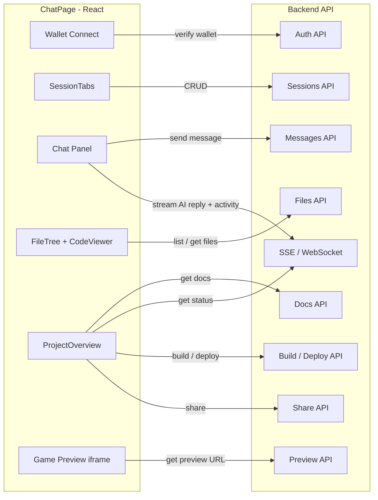

# Backend API Dependencies — ChatPage

> Spec for all backend interactions needed by `ChatPage.tsx` and its sub-components.

> [!NOTE]
> The page is currently **100% client-side** with hardcoded mock data (`AI_RESPONSES`, `SOKOBAN_FILES`, inline docs). No `fetch` or `axios` calls exist yet. Every feature below needs a new backend endpoint.

---

## 0. Authentication / Wallet Identity

All endpoints use `:walletId` as a path parameter, implying wallet-based auth. The frontend currently has **no wallet connection or auth** on the ChatPage itself — only the game preview iframe's child app uses `@mysten/dapp-kit`.

| Action | Method | Endpoint | Response |
|--------|--------|----------|----------|
| Verify wallet / get or create user | `POST` | `/api/auth/wallet` | `{ walletId, token }` |

> [!IMPORTANT]
> A middleware or token mechanism is needed so that `:walletId` in all subsequent API calls is authenticated. The frontend will need a wallet-connect flow (Slush/Sui Wallet/ZK Login) added to `ChatPage` before any API calls can be made.

**Currently:** No auth exists on the page. The `:walletId` parameter has no source yet.

---

## 1. Sessions (CRUD)

Manages the tab-based multi-session system (`SessionTabs` component).

| Action | Method | Endpoint | Request Body | Response |
|--------|--------|----------|-------------|----------|
| List sessions | `GET` | `/api/users/:walletId/sessions` | — | `Session[]` |
| Create session | `POST` | `/api/users/:walletId/sessions` | `{ name?: string }` | `Session` |
| Rename session | `PATCH` | `/api/users/:walletId/sessions/:sessionId` | `{ name: string }` | `Session` |
| Delete session | `DELETE` | `/api/users/:walletId/sessions/:sessionId` | — | `{ success: true }` |

### `Session` Schema
```json
{
  "id": "string",
  "name": "string",
  "status": "idle | adding_code | building | debugging | deploying | ready",
  "isProjectPlayable": false,
  "isProjectBuildable": false,
  "createdAt": "ISO8601",
  "updatedAt": "ISO8601"
}
```

**Currently mocked by:** `createSession()` (line 53) and local `useState` (line 76).

---

## 2. Chat / Messaging

The core AI conversation engine. Currently faked with `AI_RESPONSES[]` and `setTimeout`.

| Action | Method | Endpoint | Request Body | Response |
|--------|--------|----------|-------------|----------|
| Get chat history | `GET` | `/api/users/:walletId/sessions/:sessionId/messages` | — | `Message[]` |
| Send message | `POST` | `/api/users/:walletId/sessions/:sessionId/messages` | `{ content: string }` | `Message` (user echo) |
| Stream AI reply | `SSE` / `WebSocket` | `/api/users/:walletId/sessions/:sessionId/messages/stream` | — | Streamed `Message` chunks |

### `Message` Schema
```json
{
  "id": "string",
  "role": "user | ai",
  "content": "string (supports markdown)",
  "timestamp": "ISO8601"
}
```

### AI Activity Events (via SSE/WebSocket)
The backend should push **activity state changes** so the frontend can show the animated status indicators (`ActivityIndicator` component):

```json
{
  "type": "activity",
  "activity": "thinking | writing_code | debugging | deploying | waiting_for_user | error"
}
```

**Currently mocked by:** `handleSend()` (line 222) — cycles through `AI_RESPONSES` with fake activity states.

---

## 3. Project Status

Real-time project build pipeline status shown in the sidebar and `ProjectOverview` component.

| Action | Method | Endpoint | Response |
|--------|--------|----------|----------|
| Get project status | `GET` | `/api/users/:walletId/sessions/:sessionId/status` | `ProjectStatusResponse` |
| Subscribe to status changes | `SSE` | `/api/users/:walletId/sessions/:sessionId/status/stream` | Streamed status updates |

### `ProjectStatusResponse` Schema
```json
{
  "status": "idle | adding_code | building | debugging | deploying | ready",
  "isProjectPlayable": false,
  "isProjectBuildable": false,
  "currentStep": 0,
  "totalSteps": 6,
  "features": [
    { "label": "On-chain game logic", "done": true },
    { "label": "Two-player support", "done": false }
  ]
}
```

> [!IMPORTANT]
> Status updates (`status`, `isProjectPlayable`, `isProjectBuildable`) should be **pushed in real-time** via SSE or WebSocket to avoid polling. The frontend uses these to toggle button states and show pulsing indicators.

**Currently mocked by:** `statusFlow` array in `handleSend()` (line 244) and hardcoded `FEATURES` in `ProjectOverview.tsx`.

---

## 4. Project Files

The file explorer panel (`FileTree` + `CodeViewer` components). Files are generated/updated by the AI during conversation.

| Action | Method | Endpoint | Response |
|--------|--------|----------|----------|
| List all project files | `GET` | `/api/users/:walletId/sessions/:sessionId/files` | `{ files: FileIndex[] }` |
| Get single file content | `GET` | `/api/users/:walletId/sessions/:sessionId/files/:filePath` | `FileContent` |

### `FileIndex[]` — List Response (no content, metadata only)
```json
{
  "files": [
    { "path": "Move.toml",              "size": 708,   "type": "file" },
    { "path": "sources/game.move",       "size": 19418, "type": "file" },
    { "path": "ui/src/App.tsx",          "size": 2269,  "type": "file" },
    { "path": "ui/src/components/GameBoard.tsx", "size": 9588, "type": "file" }
  ]
}
```

### `FileContent` — Single File Response (includes content)
```json
{
  "path": "sources/game.move",
  "content": "module bird_tapping::game;\n\nuse std::ascii;\n...",
  "size": 19418
}
```

> [!IMPORTANT]
> The file list endpoint returns **only metadata** (`path`, `size`, `type`) — no `content` field. Content is fetched on-demand per file. This keeps the index response lightweight even for large projects.

> [!TIP]
> File updates can also be pushed via the same SSE/WebSocket channel used for chat messages, so the file tree updates live as the AI writes code.

**Currently mocked by:** `SOKOBAN_FILES` import from `sokobanProject.ts` (line 9).

---

## 5. Project Documents

Markdown documents shown in the `ProjectOverview` "Documents" tab section (Game Design, Player Flow, Technical Architecture, etc.).

| Action | Method | Endpoint | Response |
|--------|--------|----------|----------|
| List project docs | `GET` | `/api/users/:walletId/sessions/:sessionId/docs` | `DocFile[]` |

### `DocFile` Schema
```json
{
  "title": "Game Design",
  "content": "# Sokoban — On-Chain Puzzle Game\n\n## Overview\n..."
}
```

**Currently mocked by:** Hardcoded `docs` array in the initial session state (line 83-157).

---

## 6. Build & Deploy Actions

Action buttons in the IDE code panel and `ProjectOverview`.

| Action | Method | Endpoint | Request Body | Response |
|--------|--------|----------|-------------|----------|
| Build project | `POST` | `/api/users/:walletId/sessions/:sessionId/build` | — | `{ jobId: string }` |
| Deploy to testnet | `POST` | `/api/users/:walletId/sessions/:sessionId/deploy` | `{ network: "testnet" }` | `{ jobId: string }` |
| Get job status | `GET` | `/api/users/:walletId/sessions/:sessionId/jobs/:jobId` | — | `JobStatus` |
| Stream build logs | `SSE` | `/api/users/:walletId/sessions/:sessionId/jobs/:jobId/logs` | — | Streamed log lines |

### `JobStatus` Schema
```json
{
  "jobId": "string",
  "type": "build | deploy",
  "status": "queued | running | success | failed",
  "logs": "string[]",
  "result": {
    "packageId": "0x...",
    "previewUrl": "https://..."
  }
}
```

> [!NOTE]
> An existing endpoint already exists at `GET /api/users/:walletId/sessions/:sessionId/files/ui/start_build` from a prior conversation — this should be consolidated into the `POST /build` endpoint above.

**Currently mocked by:** Non-functional "Build Project" button (line 434) and disabled "Deploy to Testnet" button in `ProjectOverview`.

---

## 7. Share Project

The "Share" button in `ProjectOverview` (ghost button, line ~108 in `ProjectOverview.tsx`). Currently non-functional.

| Action | Method | Endpoint | Request Body | Response |
|--------|--------|----------|-------------|----------|
| Generate share link | `POST` | `/api/users/:walletId/sessions/:sessionId/share` | `{ visibility?: "public" \| "unlisted" }` | `{ shareUrl: string, shareId: string }` |

**Currently mocked by:** Non-functional `<button>` with `FiShare2` icon in `ProjectOverview.tsx`.

---

## 8. Game Preview URL

The iframe-based game preview panel needs a dynamic URL per session.

| Action | Method | Endpoint | Response |
|--------|--------|----------|----------|
| Get preview URL | `GET` | `/api/users/:walletId/sessions/:sessionId/preview` | `{ url: string }` |

**Currently hardcoded to:** `https://sui-on-chain-games-examples.vercel.app/sokoban/` (line 452, 464).

---

## Data Flow Diagram



---

## Endpoint Inventory

| # | Method | Endpoint | Purpose |
|---|--------|----------|---------|
| 1 | `POST` | `/api/auth/wallet` | Verify wallet / create user |
| 2 | `GET` | `/api/users/:walletId/sessions` | List all sessions |
| 3 | `POST` | `/api/users/:walletId/sessions` | Create new session |
| 4 | `PATCH` | `/api/users/:walletId/sessions/:sessionId` | Rename session |
| 5 | `DELETE` | `/api/users/:walletId/sessions/:sessionId` | Delete session |
| 6 | `GET` | `/api/users/:walletId/sessions/:sessionId/messages` | Get chat history |
| 7 | `POST` | `/api/users/:walletId/sessions/:sessionId/messages` | Send user message |
| 8 | `SSE` | `/api/users/:walletId/sessions/:sessionId/messages/stream` | Stream AI reply + activity |
| 9 | `GET` | `/api/users/:walletId/sessions/:sessionId/status` | Get project status |
| 10 | `SSE` | `/api/users/:walletId/sessions/:sessionId/status/stream` | Stream status changes |
| 11 | `GET` | `/api/users/:walletId/sessions/:sessionId/files` | List project files |
| 12 | `GET` | `/api/users/:walletId/sessions/:sessionId/files/:filePath` | Get file content |
| 13 | `GET` | `/api/users/:walletId/sessions/:sessionId/docs` | List project documents |
| 14 | `POST` | `/api/users/:walletId/sessions/:sessionId/build` | Trigger project build |
| 15 | `POST` | `/api/users/:walletId/sessions/:sessionId/deploy` | Deploy to testnet |
| 16 | `GET` | `/api/users/:walletId/sessions/:sessionId/jobs/:jobId` | Poll build/deploy job |
| 17 | `SSE` | `/api/users/:walletId/sessions/:sessionId/jobs/:jobId/logs` | Stream build/deploy logs |
| 18 | `POST` | `/api/users/:walletId/sessions/:sessionId/share` | Generate share link |
| 19 | `GET` | `/api/users/:walletId/sessions/:sessionId/preview` | Get game preview URL |

**Total: 19 endpoints** (13 REST + 3 SSE streams + 3 action triggers)

---

## Cross-Check Notes

Components verified line-by-line against this spec:

| Component | Backend needs? | Covered? |
|-----------|---------------|----------|
| `ChatPage.tsx` (540 lines) | Sessions, messages, status, files, docs, preview | ✅ §1–8 |
| `SessionTabs.tsx` | CRUD (create, rename, close) | ✅ §1 |
| `ChatMessage.tsx` | Message display + activity indicator | ✅ §2 |
| `ProjectOverview.tsx` | Status, features, docs, play, deploy, **share**, open-live | ✅ §3,5,6,7 |
| `FileTree.tsx` | Pure display (data from parent) | ✅ §4 |
| `CodeViewer.tsx` | Pure display + clipboard (no backend) | ✅ §4 |
| `sokobanProject.ts` / `mockProject.ts` | Static types + mock data | ✅ §4 |

**Purely client-side features** (no backend needed):
- Resize handle drag (`chatWidth` state)
- IDE tab switching (overview/code)
- File tree expand/collapse (`expandedDirs` state)
- Code syntax highlighting (Prism.js)
- Copy-to-clipboard (`navigator.clipboard`)
- Debug toolbar (dev-only UI)
